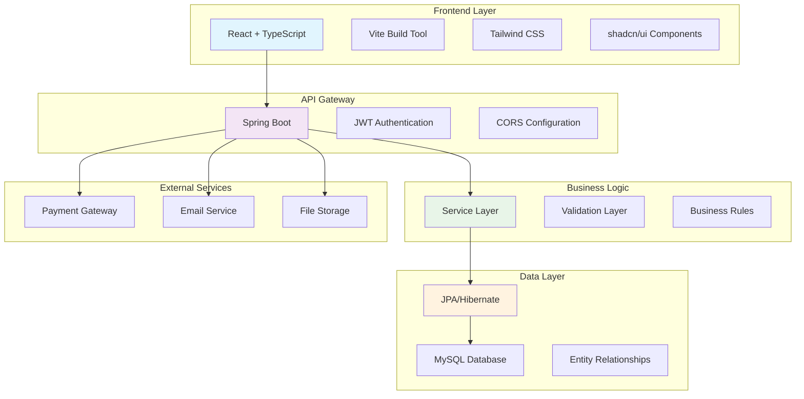
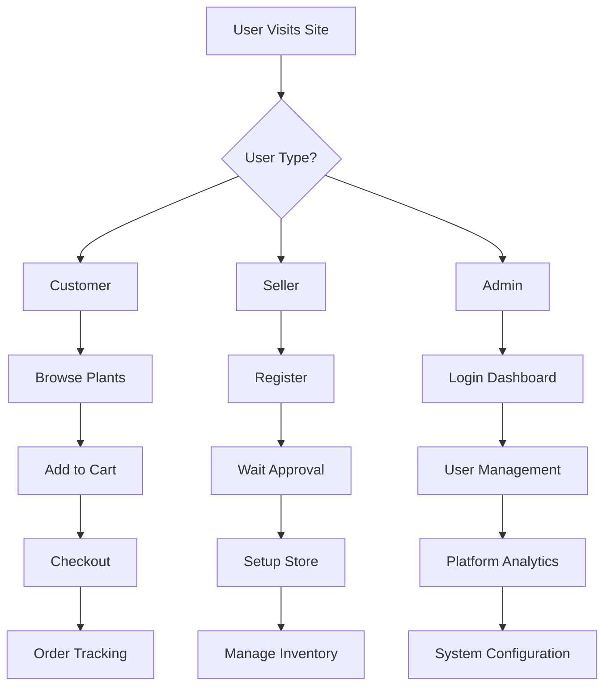

# 🌿 GreenMed - Plant Management System

<div align="center">


[](https://opensource.org/licenses/MIT)
[](https://github.com/starboy1402/GreenMed/pulls)
[](https://github.com/starboy1402/GreenMed)

---

**🌱 Bangladesh's Premier Online Marketplace for Natural Wellness & Gardening 🌱**

*Empowering communities with nature's healing power through innovative technology*

[🚀 Live Demo](#) • [📖 Documentation](#) • [🐛 Report Bug](https://github.com/starboy1402/GreenMed/issues) • [✨ Request Feature](https://github.com/starboy1402/GreenMed/issues)

---

</div>

## 📋 Table of Contents

- [🌟 Overview](#-overview)
- [✨ Features](#-features)
- [🏗️ Architecture](#️-architecture)
- [🛠️ Tech Stack](#️-tech-stack)
- [📋 Prerequisites](#-prerequisites)
- [🚀 Quick Start](#-quick-start)
- [📊 Database Setup](#-database-setup)
- [🔧 Installation](#-installation)
- [🎯 Usage](#-usage)
- [📁 Project Structure](#-project-structure)
- [🔐 API Documentation](#-api-documentation)
- [🎨 UI/UX Design](#-uiux-design)
- [🛡️ Security](#️-security)
- [🔄 Development Workflow](#-development-workflow)
- [🐛 Troubleshooting](#-troubleshooting)
- [📦 Deployment](#-deployment)
- [🤝 Contributing](#-contributing)
- [📄 License](#-license)
- [👥 Team](#-team)
- [📞 Support](#-support)
- [🙏 Acknowledgments](#-acknowledgments)

---

## 🌟 Overview

<div align="center">

### **Welcome to GreenMed** 🌿

GreenMed is a revolutionary plant management system that bridges the gap between traditional herbal wisdom and modern technology. Our platform serves as Bangladesh's premier online marketplace, connecting local farmers, herbalists, and wellness seekers in a vibrant ecosystem of natural healing and sustainable agriculture.

</div>

### 🎯 Mission
> *"To democratize access to nature's pharmacy and empower communities with sustainable, technology-driven solutions for health and wellness."*

### 🌍 Vision
> *"A world where every household has access to nature's healing power through trusted, transparent, and sustainable supply chains."*

### 💡 Key Highlights
- **🏪 Multi-Vendor Marketplace**: Connect with verified local sellers
- **🌱 Comprehensive Plant Database**: 500+ medicinal plants with detailed care instructions
- **📊 Real-Time Analytics**: Live statistics and performance metrics
- **🔒 Secure Transactions**: JWT-based authentication with role-based access
- **📱 Responsive Design**: Seamless experience across all devices
- **🌐 Multi-Language Support**: Bengali and English interfaces

---

## ✨ Features

<div align="center">

### 🚀 Core Features

| Feature | Description | Status |
|---------|-------------|--------|
| 🔐 **Multi-Role Authentication** | Admin, Seller, Customer roles with granular permissions | ✅ Complete |
| 🌿 **Plant Catalog Management** | Comprehensive database with care instructions and disease management | ✅ Complete |
| 📦 **Inventory Management** | Real-time stock tracking with automated alerts | ✅ Complete |
| 🛒 **Order Processing** | Complete e-commerce workflow with payment integration | ✅ Complete |
| 📊 **Analytics Dashboard** | Real-time statistics and performance metrics | ✅ Complete |
| 💬 **Interactive Plant Care** | AI-powered plant disease diagnosis and treatment recommendations | 🚧 In Progress |
| 📱 **Mobile App** | Native iOS and Android applications | 📅 Planned |
| 🌐 **Multi-Vendor API** | RESTful APIs for third-party integrations | ✅ Complete |

</div>

### 🎨 User Experience Features

#### 🌟 For Customers
- **🛍️ One-Click Ordering**: Seamless purchase experience
- **📍 Location-Based Search**: Find sellers in your area
- **⭐ Review System**: Rate and review products and sellers
- **📱 Order Tracking**: Real-time delivery updates
- **💝 Wishlist**: Save favorite plants and products
- **🔔 Smart Notifications**: Order updates and promotions

#### 🌟 For Sellers
- **📊 Dashboard Analytics**: Sales performance and customer insights
- **📦 Inventory Management**: Automated stock level monitoring
- **💰 Revenue Tracking**: Detailed financial reports
- **📈 Growth Analytics**: Customer acquisition and retention metrics
- **🎯 Marketing Tools**: Promotional campaigns and discounts

#### 🌟 For Administrators
- **👥 User Management**: Complete user lifecycle management
- **📊 System Analytics**: Platform-wide performance metrics
- **🔧 Configuration**: Dynamic system settings
- **📋 Audit Logs**: Complete activity tracking
- **🚨 Moderation Tools**: Content and user moderation

---

## 🏗️ Architecture



### 🏛️ System Architecture

- **Frontend**: Single Page Application with component-based architecture
- **Backend**: Microservices-ready with clear separation of concerns
- **Database**: Normalized relational database with optimized queries
- **Security**: Multi-layer security with JWT and role-based access control
- **Scalability**: Horizontal scaling ready with stateless design

---

## 🛠️ Tech Stack

<div align="center">

### 🎨 Frontend Stack

| Technology | Version | Purpose |
|------------|---------|---------|
|  | 18.3.1 | UI Framework |
|  | 5.8.3 | Type Safety |
|  | 5.4.19 | Build Tool |
|  | 3.4.17 | CSS Framework |
|  | Latest | UI Components |

### ⚙️ Backend Stack

| Technology | Version | Purpose |
|------------|---------|---------|
|  | 3.2.0 | Framework |
|  | 17 | Runtime |
|  | 6.2.0 | Security |
|  | 0.12.3 | Authentication |
|  | 8.0 | Database |

### 🛠️ Development Tools

| Tool | Purpose |
|------|---------|
|  | Dependency Management |
|  | Version Control |
|  | IDE |
|  | API Testing |

</div>

---

## 📋 Prerequisites

<div align="center">

### ✅ System Requirements

| Component | Version | Download Link |
|-----------|---------|---------------|
| **Node.js** | ≥16.0.0 | [Download](https://nodejs.org/) |
| **Java JDK** | ≥17.0.0 | [Download](https://adoptium.net/) |
| **Maven** | ≥3.6.0 | [Download](https://maven.apache.org/) |
| **MySQL** | ≥8.0.0 | [Download](https://dev.mysql.com/) |
| **Git** | ≥2.30.0 | [Download](https://git-scm.com/) |

### 🔍 Verification Commands

```bash
# Check Node.js version
node --version

# Check Java version
java -version

# Check Maven version
mvn -version

# Check MySQL version
mysql --version

# Check Git version
git --version
```

</div>

---

## 🚀 Quick Start

<div align="center">

### ⚡ Get Up and Running in 5 Minutes!

```bash
# 1. Clone the repository
git clone https://github.com/starboy1402/GreenMed.git
cd GreenMed

# 2. Setup database
mysql -u root -p < database/setup.sql

# 3. Start backend
cd PlantManagementSystem-backend/backend
mvn spring-boot:run

# 4. Start frontend (new terminal)
cd ../../
npm install
npm run dev

# 5. Open your browser
# Frontend: http://localhost:8081
# Backend: http://localhost:8080
```

🎉 **You're all set!** Visit [http://localhost:8081](http://localhost:8081) to explore GreenMed!

</div>

---

## 📊 Database Setup

### 🗄️ Database Configuration

```sql
-- Create database
CREATE DATABASE plant_management_db CHARACTER SET utf8mb4 COLLATE utf8mb4_unicode_ci;

-- Create user (optional but recommended)
CREATE USER 'greenmed_user'@'localhost' IDENTIFIED BY 'secure_password_123';
GRANT ALL PRIVILEGES ON plant_management_db.* TO 'greenmed_user'@'localhost';
FLUSH PRIVILEGES;

-- Use the database
USE plant_management_db;
```

### 🔧 Application Properties

```properties
# Database Configuration
spring.datasource.url=jdbc:mysql://localhost:3306/plant_management_db
spring.datasource.username=greenmed_user
spring.datasource.password=secure_password_123
spring.datasource.driver-class-name=com.mysql.cj.jdbc.Driver

# JPA Configuration
spring.jpa.hibernate.ddl-auto=update
spring.jpa.show-sql=true
spring.jpa.properties.hibernate.format_sql=true
spring.jpa.properties.hibernate.dialect=org.hibernate.dialect.MySQL8Dialect

# JWT Configuration
jwt.secret=your_super_secure_jwt_secret_key_here_minimum_256_bits
jwt.expiration=86400000

# Server Configuration
server.port=8080
server.servlet.context-path=/
```

---

## 🔧 Installation

### 📥 Clone & Setup

```bash
# Clone the repository
git clone https://github.com/starboy1402/GreenMed.git
cd GreenMed

# Create environment file
cp .env.example .env
# Edit .env with your configuration
```

### ⚙️ Backend Installation

```bash
# Navigate to backend
cd PlantManagementSystem-backend/backend

# Install dependencies
mvn clean install

# Run the application
mvn spring-boot:run
```

### 🎨 Frontend Installation

```bash
# Navigate to frontend (from root)
cd ../..

# Install dependencies
npm install

# Start development server
npm run dev

# Build for production
npm run build
```

### 🐳 Docker Installation (Optional)

```bash
# Build and run with Docker Compose
docker-compose up -d

# Or build individual services
docker build -t greenmed-backend ./PlantManagementSystem-backend/backend
docker build -t greenmed-frontend .
```

---

## 🎯 Usage

### 👤 User Roles & Workflows

#### 🌟 Customer Journey
1. **Browse** plants and products
2. **Search** by category, location, or health benefits
3. **Add to cart** and checkout
4. **Track orders** in real-time
5. **Rate & review** products and sellers

#### 🏪 Seller Journey
1. **Register** as a seller
2. **Wait for approval** from admin
3. **Setup inventory** and pricing
4. **Manage orders** and shipping
5. **Track sales** and analytics

#### 👨‍💼 Admin Journey
1. **Login** to admin dashboard
2. **Approve seller** applications
3. **Monitor platform** analytics
4. **Manage users** and content
5. **Configure system** settings

### 📱 Key User Flows



---

## 📁 Project Structure

```
GreenMed/
├── 📁 PlantManagementSystem-backend/
│   └── 📁 backend/
│       ├── 📄 pom.xml
│       └── 📁 src/main/java/com/plantmanagement/
│           ├── 📁 config/           # Configuration classes
│           ├── 📁 controller/       # REST API controllers
│           ├── 📁 dto/             # Data Transfer Objects
│           ├── 📁 entity/          # JPA entities
│           ├── 📁 repository/      # Data access layer
│           ├── 📁 service/         # Business logic
│           ├── 📁 security/        # Security configuration
│           └── 📁 util/            # Utility classes
│
├── 📁 src/                         # Frontend source
│   ├── 📁 components/
│   │   ├── 📁 Auth/               # Authentication components
│   │   ├── 📁 Forms/              # Form components
│   │   ├── 📁 Layout/             # Layout components
│   │   ├── 📁 Tables/             # Data table components
│   │   └── 📁 ui/                 # Reusable UI components
│   ├── 📁 context/                # React context providers
│   ├── 📁 hooks/                  # Custom React hooks
│   ├── 📁 lib/                    # Utility functions & API
│   └── 📁 pages/                  # Page components
│
├── 📁 public/                     # Static assets
├── 📄 package.json                # Frontend dependencies
├── 📄 vite.config.ts              # Vite configuration
├── 📄 tailwind.config.ts          # Tailwind configuration
├── 📄 tsconfig.json               # TypeScript configuration
└── 📄 README.md                   # This file
```

---

## 🔐 API Documentation

### 🌐 Base URL
```
http://localhost:8080/api
```

### 🔑 Authentication Endpoints

| Method | Endpoint | Description | Auth Required |
|--------|----------|-------------|---------------|
| `POST` | `/auth/signup` | User registration | ❌ No |
| `POST` | `/auth/login` | User authentication | ❌ No |
| `POST` | `/auth/logout` | User logout | ✅ Yes |
| `GET` | `/auth/me` | Get current user | ✅ Yes |

### 📊 Dashboard Endpoints

| Method | Endpoint | Description | Role Required |
|--------|----------|-------------|---------------|
| `GET` | `/dashboard/public-stats` | Public statistics | None |
| `GET` | `/dashboard/admin-stats` | Admin dashboard stats | ADMIN |
| `GET` | `/dashboard/seller-stats` | Seller dashboard stats | SELLER |

### 🌿 Plant Management

| Method | Endpoint | Description | Role Required |
|--------|----------|-------------|---------------|
| `GET` | `/plants` | Get all plants | None |
| `POST` | `/plants` | Create new plant | ADMIN |
| `PUT` | `/plants/{id}` | Update plant | ADMIN |
| `DELETE` | `/plants/{id}` | Delete plant | ADMIN |

### 📦 Order Management

| Method | Endpoint | Description | Role Required |
|--------|----------|-------------|---------------|
| `POST` | `/orders` | Create new order | CUSTOMER |
| `GET` | `/orders/customer` | Get customer orders | CUSTOMER |
| `GET` | `/orders/seller` | Get seller orders | SELLER |
| `GET` | `/admin/orders` | Get all orders | ADMIN |

### 📝 API Response Format

```json
{
  "success": true,
  "message": "Operation successful",
  "data": {
    // Response data
  },
  "timestamp": "2025-01-20T10:30:00Z"
}
```

---

## 🎨 UI/UX Design

### 🎨 Design System

- **🌈 Color Palette**: Nature-inspired greens and earth tones
- **🔤 Typography**: Clean, readable fonts with proper hierarchy
- **📐 Spacing**: Consistent spacing scale using Tailwind CSS
- **🎭 Animations**: Smooth transitions and micro-interactions
- **📱 Responsive**: Mobile-first design approach

### 🖼️ Screenshots

<div align="center">

#### 🏠 Landing Page


#### 📊 Dashboard


#### 🌿 Plant Catalog


</div>

---

## 🛡️ Security

### 🔒 Security Features

- **JWT Authentication** with secure token management
- **BCrypt Password Hashing** for secure password storage
- **Role-Based Access Control** (RBAC) with granular permissions
- **CORS Configuration** for secure cross-origin requests
- **Input Validation** using Bean Validation
- **SQL Injection Prevention** with parameterized queries
- **XSS Protection** with proper input sanitization

### 🔐 Security Best Practices

```java
// Example: Secure password encoding
@Bean
public PasswordEncoder passwordEncoder() {
    return new BCryptPasswordEncoder();
}

// Example: JWT token validation
public Boolean isTokenValid(String token) {
    try {
        Jwts.parser()
            .verifyWith(getSigningKey())
            .build()
            .parseSignedClaims(token);
        return !isTokenExpired(token);
    } catch (Exception e) {
        return false;
    }
}
```

---

## 🔄 Development Workflow

### 🚀 Development Setup

```bash
# 1. Clone and setup
git clone https://github.com/starboy1402/GreenMed.git
cd GreenMed

# 2. Setup pre-commit hooks
npm run prepare

# 3. Install dependencies
npm install
cd PlantManagementSystem-backend/backend && mvn install

# 4. Start development servers
npm run dev          # Frontend (port 8081)
mvn spring-boot:run  # Backend (port 8080)
```

### 📝 Development Scripts

```json
{
  "scripts": {
    "dev": "vite",
    "build": "vite build",
    "preview": "vite preview",
    "lint": "eslint .",
    "lint:fix": "eslint . --fix",
    "type-check": "tsc --noEmit",
    "test": "vitest",
    "test:ui": "vitest --ui"
  }
}
```

### 🔄 Git Workflow

```bash
# Feature development
git checkout -b feature/amazing-feature
git add .
git commit -m "feat: add amazing feature"
git push origin feature/amazing-feature

# Create pull request
# Code review and testing
# Merge to main
```

---

## 🐛 Troubleshooting

### 🔧 Common Issues & Solutions

#### 1. **Database Connection Issues**
```bash
# Check MySQL service
sudo systemctl status mysql

# Test connection
mysql -u root -p -e "SELECT 1;"

# Reset root password if needed
sudo mysql_secure_installation
```

#### 2. **Port Conflicts**
```properties
# Change backend port in application.properties
server.port=8081

# Change frontend port in vite.config.ts
server: {
  port: 3000,
  host: true
}
```

#### 3. **CORS Issues**
```java
// Update CORS configuration in SecurityConfig.java
@Bean
public CorsConfigurationSource corsConfigurationSource() {
    CorsConfiguration configuration = new CorsConfiguration();
    configuration.setAllowedOrigins(Arrays.asList("http://localhost:8081"));
    configuration.setAllowedMethods(Arrays.asList("GET", "POST", "PUT", "DELETE"));
    configuration.setAllowedHeaders(Arrays.asList("*"));
    configuration.setAllowCredentials(true);
    
    UrlBasedCorsConfigurationSource source = new UrlBasedCorsConfigurationSource();
    source.registerCorsConfiguration("/**", configuration);
    return source;
}
```

#### 4. **JWT Token Issues**
```bash
# Clear browser localStorage
# Check JWT secret in application.properties
# Verify token expiration time
```

#### 5. **Build Issues**
```bash
# Frontend
rm -rf node_modules package-lock.json
npm install

# Backend
cd PlantManagementSystem-backend/backend
mvn clean install -DskipTests
```

---

## 📦 Deployment

### 🚀 Production Deployment

#### Backend Deployment
```bash
# Build JAR file
mvn clean package -DskipTests

# Run with specific profile
java -jar target/plant-management-backend-0.0.1-SNAPSHOT.jar --spring.profiles.active=prod
```

#### Frontend Deployment
```bash
# Build optimized bundle
npm run build

# Serve static files
npm run preview

# Or deploy to web server
# Apache/Nginx configuration needed
```

#### Docker Deployment
```yaml
# docker-compose.yml
version: '3.8'
services:
  greenmed-backend:
    build: ./PlantManagementSystem-backend/backend
    ports:
      - "8080:8080"
    environment:
      - SPRING_PROFILES_ACTIVE=prod
    depends_on:
      - mysql

  greenmed-frontend:
    build: .
    ports:
      - "80:80"
    depends_on:
      - greenmed-backend

  mysql:
    image: mysql:8.0
    environment:
      MYSQL_DATABASE: plant_management_db
      MYSQL_ROOT_PASSWORD: secure_password
    volumes:
      - mysql_data:/var/lib/mysql

volumes:
  mysql_data:
```

---

## 🤝 Contributing

<div align="center">

### 🌟 We Love Contributions!

We welcome contributions from developers of all skill levels! Here's how you can help make GreenMed even better:

</div>

### 📋 Contribution Guidelines

1. **Fork** the repository
2. **Create** a feature branch (`git checkout -b feature/AmazingFeature`)
3. **Commit** your changes (`git commit -m 'Add some AmazingFeature'`)
4. **Push** to the branch (`git push origin feature/AmazingFeature`)
5. **Open** a Pull Request

### 🏷️ Commit Message Format

```bash
feat: add new plant disease detection feature
fix: resolve login authentication bug
docs: update API documentation
style: format code with prettier
refactor: simplify user registration logic
test: add unit tests for plant service
chore: update dependencies
```

### 🧪 Testing

```bash
# Run frontend tests
npm test

# Run backend tests
mvn test

# Run integration tests
npm run test:e2e
```

### 📚 Documentation

- Update README.md for new features
- Add JSDoc comments for new functions
- Update API documentation
- Create user guides for complex features

---

## 📄 License

<div align="center">

### 📜 MIT License

```
Copyright (c) 2025 GreenMed Team

Permission is hereby granted, free of charge, to any person obtaining a copy
of this software and associated documentation files (the "Software"), to deal
in the Software without restriction, including without limitation the rights
to use, copy, modify, merge, publish, distribute, sublicense, and/or sell
copies of the Software, and to permit persons to whom the Software is
furnished to do so, subject to the following conditions:

The above copyright notice and this permission notice shall be included in all
copies or substantial portions of the Software.

THE SOFTWARE IS PROVIDED "AS IS", WITHOUT WARRANTY OF ANY KIND, EXPRESS OR
IMPLIED, INCLUDING BUT NOT LIMITED TO THE WARRANTIES OF MERCHANTABILITY,
FITNESS FOR A PARTICULAR PURPOSE AND NONINFRINGEMENT. IN NO EVENT SHALL THE
AUTHORS OR COPYRIGHT HOLDERS BE LIABLE FOR ANY CLAIM, DAMAGES OR OTHER
LIABILITY, WHETHER IN AN ACTION OF CONTRACT, TORT OR OTHERWISE, ARISING FROM,
OUT OF OR IN CONNECTION WITH THE SOFTWARE OR THE USE OR OTHER DEALINGS IN THE
SOFTWARE.
```

</div>

---

## 👥 Team

<div align="center">

### 🌟 Meet the GreenMed Team

<table>
  <tr>
    <td align="center">
      
      <br />
      <sub><b>Star Boy</b></sub>
      <br />
      <sub>Full Stack Developer</sub>
    </td>
    <td align="center">
      
      <br />
      <sub><b>UI/UX Designer</b></sub>
      <br />
      <sub>Design Lead</sub>
    </td>
    <td align="center">
      
      <br />
      <sub><b>Backend Developer</b></sub>
      <br />
      <sub>API Architect</sub>
    </td>
  </tr>
</table>

### 📧 Contact the Team

- **Project Lead**: [Star Boy](https://github.com/starboy1402)
- **Email**: contact@greenmed.com
- **LinkedIn**: [GreenMed Team](https://linkedin.com/company/greenmed)
- **Twitter**: [@GreenMedBD](https://twitter.com/GreenMedBD)

</div>

---

## 📞 Support

<div align="center">

### 🆘 Need Help?

We're here to help! Here's how to get support:

</div>

### 🐛 Bug Reports
- Use [GitHub Issues](https://github.com/starboy1402/GreenMed/issues) for bug reports
- Include detailed steps to reproduce
- Add screenshots if applicable
- Specify your environment (OS, browser, etc.)

### 💡 Feature Requests
- Check existing issues first
- Use the "Feature Request" template
- Describe the problem and proposed solution
- Explain why this feature would be valuable

### 💬 General Questions
- Check the [FAQ](#) first
- Search existing issues and discussions
- Start a [GitHub Discussion](https://github.com/starboy1402/GreenMed/discussions)

### 📧 Contact Information

| Channel | Contact | Response Time |
|---------|---------|---------------|
| 🐛 Bug Reports | [GitHub Issues](https://github.com/starboy1402/GreenMed/issues) | 24-48 hours |
| 💡 Feature Requests | [GitHub Issues](https://github.com/starboy1402/GreenMed/issues) | 1-2 days |
| 💬 General Discussion | [GitHub Discussions](https://github.com/starboy1402/GreenMed/discussions) | 12-24 hours |
| 📧 Email Support | support@greenmed.com | 24-48 hours |

---

## 🙏 Acknowledgments

<div align="center">

### 🌟 Special Thanks

We'd like to extend our heartfelt gratitude to:

</div>

### 👥 Contributors
- **Open Source Community** for amazing tools and libraries
- **Spring Boot Team** for the incredible framework
- **React Team** for the powerful UI library
- **shadcn/ui** for beautiful component library
- **Tailwind CSS** for the utility-first CSS framework

### 📚 Resources
- [Spring Boot Documentation](https://spring.io/projects/spring-boot)
- [React Documentation](https://reactjs.org/)
- [MySQL Documentation](https://dev.mysql.com/doc/)
- [JWT.io](https://jwt.io/) for JWT specifications

### 🌱 Inspiration
- Traditional herbal medicine practitioners in Bangladesh
- Sustainable agriculture communities
- Open source contributors worldwide

### 🎉 Special Mentions
- **Bangladesh Government** for supporting digital agriculture initiatives
- **Local Farmers** who preserve traditional knowledge
- **Health Practitioners** who promote natural healing

---

<div align="center">

## 🌟 Let's Build Something Amazing Together!

<div align="center">

### 🚀 Ready to Get Started?

[](https://github.com/starboy1402/GreenMed#get-started)
[](https://github.com/starboy1402/GreenMed#contributing)
[](https://github.com/starboy1402/GreenMed/stargazers)

</div>

### 📊 Project Stats


---

**Made with ❤️ in Bangladesh** 🇧🇩

*Empowering communities, one plant at a time* 🌱

---

<div align="center">

### 🌐 Connect With Us

[](https://linkedin.com/company/greenmed)
[](https://twitter.com/GreenMedBD)
[](https://facebook.com/GreenMedBD)
[](https://instagram.com/GreenMedBD)

</div>

</div>

---

**⭐ Don't forget to star this repository if you found it helpful!**

</div>

### 3. Backend Setup

1. **Navigate to backend directory**:
   ```bash
   cd PlantManagementSystem-backend/backend
   ```

2. **Configure Database Connection**:
   Edit [`src/main/resources/application.properties`](PlantManagementSystem-backend/backend/src/main/resources/application.properties):
   ```properties
   # Update these values according to your MySQL setup
   spring.datasource.url=jdbc:mysql://localhost:3306/plant_management_db
   spring.datasource.username=root
   spring.datasource.password=12345
   ```

3. **Install Dependencies & Run**:
   ```bash
   # Clean and install dependencies
   mvn clean install

   # Run the application
   mvn spring-boot:run
   ```

   The backend will start on `http://localhost:8080`

### 4. Frontend Setup

1. **Navigate to frontend directory**:
   ```bash
   cd ../../  # Go back to root directory
   ```

2. **Install Dependencies**:
   ```bash
   npm install
   ```

3. **Start Development Server**:
   ```bash
   npm run dev
   ```

   The frontend will start on `http://localhost:8081`

## 🚦 Running the Application

### Start Backend (Terminal 1):
```bash
cd PlantManagementSystem-backend/backend
mvn spring-boot:run
```

### Start Frontend (Terminal 2):
```bash
npm run dev
```

### Access the Application:
- **Frontend**: http://localhost:8081
- **Backend API**: http://localhost:8080
- **API Documentation**: http://localhost:8080/api/auth/test (Test endpoint)

## 👥 Default User Roles

The system supports three user roles:

1. **ADMIN**: Full system access, user management, plant/medicine management
2. **SELLER**: Inventory management, order processing, pending approval required
3. **CUSTOMER**: Browse plants/medicines, place orders, view order history

### User Registration:
- Customers are automatically approved
- Sellers require admin approval (status: PENDING → APPROVED)
- Admins need to be created manually in the database

## 📁 Project Structure

```
PlantManagementSystem/
├── README.md
├── package.json
├── vite.config.ts
├── tailwind.config.ts
├── src/
│   ├── components/
│   │   ├── Auth/          # Authentication components
│   │   ├── Forms/         # Form components
│   │   ├── Layout/        # Layout components
│   │   └── ui/           # UI components (shadcn/ui)
│   ├── context/
│   │   └── AuthContext.tsx
│   ├── pages/
│   │   ├── AdminDashboard.tsx
│   │   ├── SellerDashboard.tsx
│   │   ├── CustomerDashboard.tsx
│   │   └── AuthPage.tsx
│   └── lib/              # Utility functions
└── PlantManagementSystem-backend/
    └── backend/
        ├── pom.xml
        └── src/main/java/com/plantmanagement/
            ├── controller/   # REST Controllers
            ├── service/      # Business Logic
            ├── repository/   # Data Access Layer
            ├── entity/       # JPA Entities
            ├── dto/          # Data Transfer Objects
            ├── config/       # Configuration Classes
            └── security/     # Security Configuration
```

## 🔧 Configuration

### Backend Configuration
Key configuration files:
- [`application.properties`](PlantManagementSystem-backend/backend/src/main/resources/application.properties): Database and JWT settings
- [`SecurityConfig.java`](PlantManagementSystem-backend/backend/src/main/java/com/plantmanagement/config/SecurityConfig.java): Security configuration
- [`pom.xml`](PlantManagementSystem-backend/backend/pom.xml): Maven dependencies

### Frontend Configuration
Key configuration files:
- [`vite.config.ts`](vite.config.ts): Vite configuration
- [`tailwind.config.ts`](tailwind.config.ts): Tailwind CSS configuration
- [`package.json`](package.json): Dependencies and scripts

## 🛡️ Security Features

- **JWT Authentication**: Secure token-based authentication
- **Role-Based Access Control**: Different permissions for each user role
- **Password Encryption**: BCrypt password hashing
- **CORS Configuration**: Properly configured for cross-origin requests
- **Input Validation**: Bean validation on all API endpoints

## 📚 API Endpoints

### Authentication
- `POST /api/auth/signup` - User registration
- `POST /api/auth/login` - User authentication
- `POST /api/auth/logout` - User logout
- `GET /api/auth/me` - Get current user info
- `GET /api/auth/test` - Test endpoint

### Protected Routes
- `/api/admin/**` - Admin-only endpoints
- `/api/seller/**` - Seller and Admin endpoints
- `/api/customer/**` - Customer and Admin endpoints

## 🎨 UI Components

The frontend uses shadcn/ui components with a nature-inspired design system:
- Custom color palette with forest and leaf greens
- Smooth animations and transitions
- Responsive design for all screen sizes
- Accessible components following best practices

## 🔄 Development Workflow

1. **Make changes** to frontend or backend code
2. **Frontend**: Changes auto-reload with Vite dev server
3. **Backend**: Restart with `mvn spring-boot:run` after changes
4. **Database**: Schema updates are handled automatically by Hibernate

## 🐛 Troubleshooting

### Common Issues:

1. **Port conflicts**:
   - Frontend: Change port in [`vite.config.ts`](vite.config.ts)
   - Backend: Change port in [`application.properties`](PlantManagementSystem-backend/backend/src/main/resources/application.properties)

2. **Database connection issues**:
   - Verify MySQL is running
   - Check credentials in [`application.properties`](PlantManagementSystem-backend/backend/src/main/resources/application.properties)
   - Ensure database exists

3. **CORS issues**:
   - Check [`SecurityConfig.java`](PlantManagementSystem-backend/backend/src/main/java/com/plantmanagement/config/SecurityConfig.java) for allowed origins

4. **JWT Token issues**:
   - Clear browser localStorage
   - Check JWT secret in [`application.properties`](PlantManagementSystem-backend/backend/src/main/resources/application.properties)

## 📦 Build for Production

### Frontend:
```bash
npm run build
```

### Backend:
```bash
mvn clean package
java -jar target/plant-management-backend-0.0.1-SNAPSHOT.jar
```

## 🤝 Contributing

1. Fork the repository
2. Create your feature branch (`git checkout -b feature/AmazingFeature`)
3. Commit your changes (`git commit -m 'Add some AmazingFeature'`)
4. Push to the branch (`git push origin feature/AmazingFeature`)
5. Open a Pull Request

## 📄 License

This project is licensed under the MIT License - see the LICENSE file for details.

## 📞 Support

If you encounter any issues or have questions, please create an issue in the repository or contact the development team.

---

**Happy coding! 🌱**